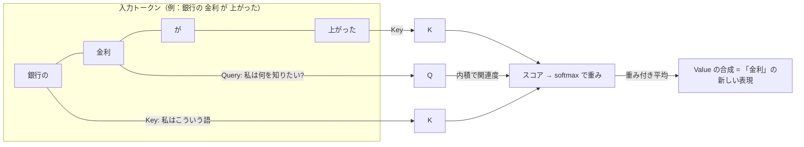

# 001 Transformer と自己注意：なぜ文脈が効くのかを図で説明する

!!! abstract "この記事で説明できるようになること"
    - 「LLM はなぜ文脈（前後の語）を踏まえて答えられるのか」を、自己注意（self-attention）の Query / Key / Value の図で 2 分で説明できる
    - 「長く書けば全部読んでくれる」が成り立たない理由を、注意機構のコストと性質から説明できる

## 仕組み

Transformer は 2017 年の論文「Attention Is All You Need」（Vaswani ら）で提案されたアーキテクチャで、それまで主流だった RNN（再帰）や CNN（畳み込み）を使わず、**注意機構（attention）だけ**で文を処理する。現在の GPT / Claude / Gemini などの LLM は、ほぼ全てこの系統にある。

核になるのが **自己注意（self-attention）**。「各単語が、文中の他の全単語に問い合わせて、関連が強い語ほど大きな重みで情報を混ぜ込む」仕組みだ。

手順は 4 ステップ：

1. 各トークンの埋め込みベクトルに学習済みの 3 つの行列を掛け、**Query（何を探しているか）・Key（自分は何者か）・Value（渡す中身）** の 3 本のベクトルを作る
2. ある語の Query と、全ての語の Key の内積を取り「関連度スコア」を出す
3. スコアを softmax で 0〜1 の重みに正規化する
4. 重みで各語の Value を加重平均し、その語の新しい表現にする

これを **複数の頭（multi-head attention）** で並列に行う（原論文は 8 頭）。頭ごとに「文法的な係り受け」「指示語の先」「トピック」など違う観点で注目できる。さらに、注意機構は語順を知らないので、**位置エンコーディング（positional encoding）** を埋め込みに足して「何番目の語か」を伝える。

ポイントは、RNN のように左から右へ順に読むのではなく、**全ての語が全ての語を一度に見る**こと。だから離れた語同士の関係（「先週の会議で決めた件、あれ」の「あれ」が何か）を直接つかめる。原論文ではこの設計で英独翻訳 28.4 BLEU を達成し、従来より大幅に短い学習時間（8 GPU で 3.5 日）で済んだと報告されている。

## 比較・判断基準

| 観点 | RNN / LSTM（旧来） | Transformer |
|---|---|---|
| 文脈の取り方 | 前から順に状態を引き継ぐ | 全トークン同士を一度に参照 |
| 離れた語の関係 | 距離が遠いほど薄れる | 距離に関係なく直接参照 |
| 並列計算 | しにくい（逐次） | しやすい（学習が速い） |
| 長さに対するコスト | 線形 | 注意計算が **長さの 2 乗** |
| 実務での位置づけ | 現在の LLM ではほぼ使われない | GPT / Claude / Gemini 等の基盤 |

「どちらを選ぶか」はもはや論点ではなく、実務では **Transformer の性質（全体参照・2 乗コスト・位置の扱い）を前提に入力を設計する**ことが判断基準になる。

## 落とし穴

1. **「長い文脈なら全部同じ重みで読んでいる」と思う**：注意は重み付き平均であり、全てに均等に注目するわけではない。長文の中間部分が軽視されやすい「lost in the middle」と呼ばれる傾向も指摘されており、重要な指示は先頭か末尾に置くのが実務上の定石（出典を含めて 019 で扱う）。
2. **「人間のように意味を理解している」と説明する**：自己注意は「どの語にどれだけ注目するか」の統計的な重み付けであって、意味の理解そのものではない。受講者に「注目している語が見える仕組み」として説明すると誤解が少ない。
3. **「文脈を増やせばコストは比例」と見積もる**：注意計算は長さの 2 乗で増える。長文入力を常用する設計は、レイテンシと料金の両方で効いてくる（005 コンテキストウィンドウで再訪）。

## 実務への接続

- **プロンプトの書き方に直結**：LLM は「近くにある語・明示された語」を手がかりにするので、「前提・制約・出力形式」をはっきり書く＝注目すべき Key を与えることになる。
- **RAG の設計**：検索で取ってきた文書をそのまま大量に詰めるより、関連部分を絞って渡した方が「注目の分散」を防げる。
- **今日のニュースとの接点**：A2A / MCP でエージェント同士が連携する時代でも、個々のモデルが「渡された文脈のどこに注目するか」は変わらない。検証すべき情報を目立つ形で渡す設計が、連携の品質を左右する（→ [daily/2026-08-19](../../daily/2026-08-19.md)）。

## 講座で使うなら

- 30 秒説明: 「LLM は 1 語ずつ『他のどの語を見れば自分の意味が決まるか』を全語に問い合わせ、関連が強い語を重く混ぜて理解します。これが自己注意。だから前後の文脈で答えが変わります」
- たとえ話: 会議室で全員が同時に「この件、誰の発言が関係ある？」と互いの名札（Key）を見て、関係が強い人の話（Value）を多めに聞く。司会（RNN）が順番に一人ずつ聞く方式より、離れた席の人の話も拾える。
- 演習案: 短い社内文書（5〜6 文）を配り、「この語の意味を決めるのに注目すべき語」を手で線で結ばせる。その後 AI に同じ文書を要約させ、自分の線と AI の要約の重点がどう違うかを比べる。

## 出典・参考

- [Attention Is All You Need — arXiv:1706.03762](https://arxiv.org/abs/1706.03762)（取得日 2026-08-19）
- [The Illustrated Transformer — Jay Alammar](https://jalammar.github.io/illustrated-transformer/)（取得日 2026-08-19）

## 関連

- [topics/transformer](../../topics/transformer.md)
- 次回：002 トークナイザー（日本語が不利になる理由とコスト）
