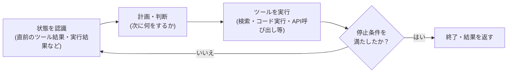

# 029 エージェントとは何か：ループ・ツール・状態・停止条件

!!! abstract "この記事で説明できるようになること"
    - 「ワークフロー」と「エージェント」の違いを、制御の所在で説明できる
    - エージェントの基本ループ（知覚→計画・行動→ツール利用）を図で説明できる
    - 暴走やコスト超過を防ぐ「停止条件」の考え方を説明できる

## 仕組み

Anthropicのエンジニアリングブログは、ワークフローとエージェントを次のように区別している（出典: Building Effective Agents）。

- **ワークフロー**：LLMとツールを、あらかじめ決められたコードパスに沿って動かす仕組み。分岐や手順は人間が事前に設計する
- **エージェント**：LLM自身が自分の処理やツール利用を動的に決める仕組み。次に何をするかを都度LLMが判断する

エージェントは、おおむね次のループを繰り返す。

- **状態（state）**：直前のツール結果やコード実行結果など、「環境からの生の事実（ground truth）」を毎ステップ受け取る（出典: 同上）。会話履歴やファイル内容も状態の一部
- **ツール（tool）**：エージェントが外部とやり取りする手段。検索・コード実行・API呼び出しなど。ツールの説明文（ドキュメント）が曖昧だと、エージェントは誤った使い方をしやすい
- **停止条件**：タスク完了時に止まるのが基本だが、それとは別に「最大反復回数」のような上限を設けるのが一般的（出典: 同上）。これがないと、誤った判断がループするたびに積み重なり、時間・コストの両面で暴走しうる

## 比較・判断基準

| | ワークフロー | エージェント |
|---|---|---|
| 制御 | 人間が事前に設計 | LLMが都度判断 |
| 向くタスク | 手順が明確で再現性が必要な定型業務 | 手順が事前に決めきれない探索的な業務 |
| 予測可能性 | 高い | 低い（同じ入力でも経路が変わりうる） |
| コスト管理 | 見積もりやすい | 停止条件の設計次第で変動しやすい |

判断基準はシンプルで、「手順を先に書き切れるか」。書き切れるならワークフロー、書き切れず都度の判断が必要ならエージェント、というのが出発点になる。

## 落とし穴

1. **停止条件を決めずに動かす**：最大反復回数やタイムアウトを設定しないと、判断ミスがループのたびに積み重なり、時間もコストも青天井になりうる
2. **ツールの説明が曖昧**：ツールの入出力や使いどころの説明が不十分だと、エージェントが誤った引数で呼び出したり、不要な場面で使ったりする
3. **「エージェントにすれば何でも解決する」という誤解**：手順が固定的な業務にエージェントを使うと、ワークフローより遅く・不安定になりやすい。まずワークフローで足りないかを検討する

## 実務への接続

業務効率化の文脈では、「毎回手順が同じ定型作業」はワークフロー（決まったスクリプト・RPA的な自動化）で十分なことが多い。一方、「問い合わせ内容によって調べる先が変わるカスタマー対応の一次対応」のように、都度の判断が必要な業務ではエージェントが向く。導入時は、まず対象業務が本当に「都度の判断」を必要とするかを見極め、必要ならどこまでの反復回数・予算で止めるかを最初に決めておくと、コスト超過を防ぎやすい。

## 講座で使うなら

- 30 秒説明: 「決まった手順をなぞるのがワークフロー、AI自身が『次に何をするか』をその都度決めるのがエージェントです。エージェントには『どこまでやったら止めるか』を必ず決めておく必要があります」
- たとえ話: ワークフローはレシピ通りに作る料理、エージェントは冷蔵庫の中身を見て都度メニューを考える料理人。ただし料理人にも「何品まで作ったら終わりにするか」を先に伝えておく必要がある
- 演習案: 受講者が担当する業務を1つ選び、「手順を全部書き切れるか」でワークフロー向き・エージェント向きに仕分けさせる

## 出典・参考
- [Building Effective Agents](https://www.anthropic.com/engineering/building-effective-agents)（Anthropic、取得日 2026-09-16）

## 関連
- [topics/claude-code](../../topics/claude-code.md)
- [topics/mcp](../../topics/mcp.md)
